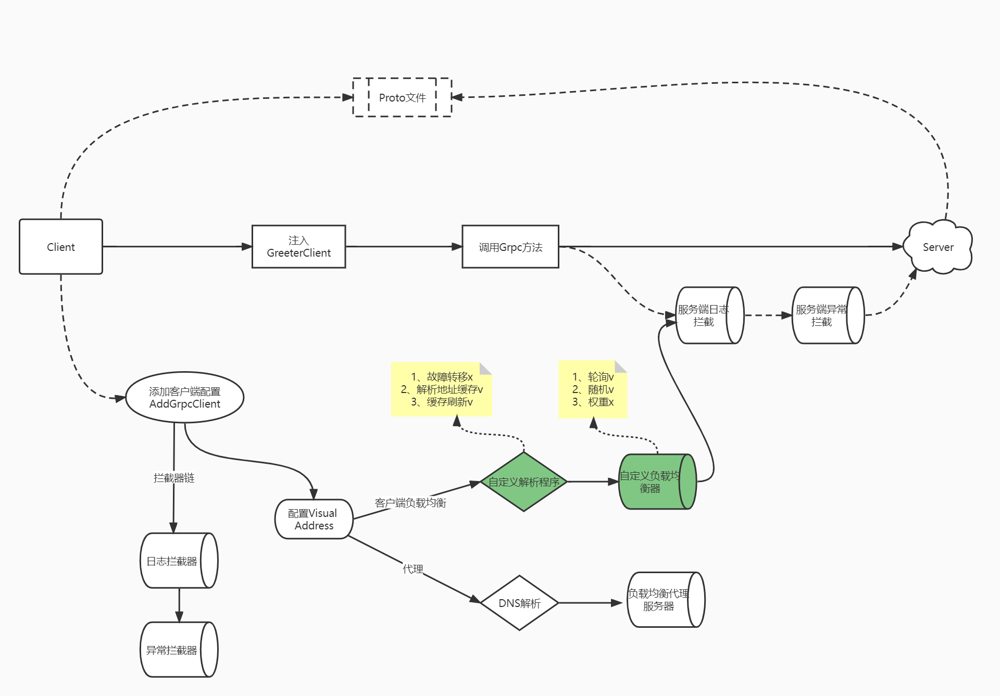
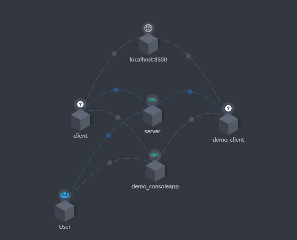

## 介绍
💕一点点关于点net的学习

💕在学习/工作的过程中，不断遇到问题，不断积累，在此一一沉淀。如果你在此过程中，也遇到一些问题，可以提出，我们将共同构建它！

### 🐣开始

```shell
$ git clone https://gitee.com/antinew/XiaoLi.NET.git
$ cd XiaoLi.NET
$ dotnet restore
```

### 😂请帮帮我
- mutil-framework compatibility
- unit test，functional test，benchmark test and more
- simple demo，useage doc
- bug issue and idel
- 
### 🐌基础能力
- [x] 生命周期自动注入
- [x] 配置项自动注入
- [x] startup自动注入
- [ ] 模块化
- [ ] 模型自动映射
- [ ] 模型验证器

### 🐸拓展能力
- [x] Consul服务发现与注册
- [x] Grpc客户端负载均衡
- [x] RabbitMQ分布式事件总线
- [x] skywalking分布式链路追踪，支持grpc


#### Grpc设计
- [x] 可自定义负载均衡算法/服务解析器
- [x] 日志拦截器，skywalking上报
- [x] 异常抛出GrpcException，可被管道捕获（适合host）
- [x] 回退机制，客户端先起，阻塞等待可用服务出现（适合work）
- [x] 服务端掉线，自动踢出可用队列
- [x] 服务不可达/grpc内部异常，自动重试机制
- [x] 连接持活机制，服务队列缓存机制等

