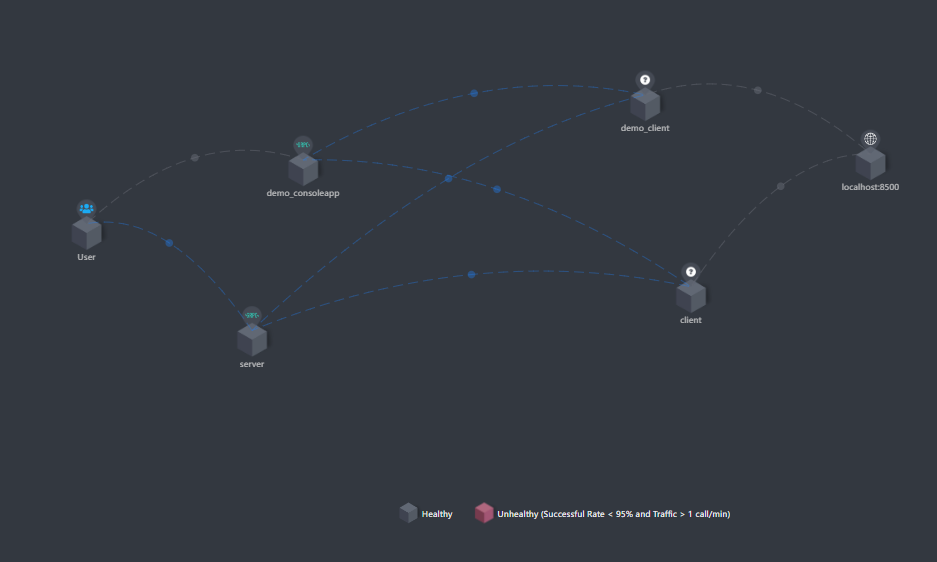

# XiaoLi.NET

```shell
git clone https://gitee.com/antinew/XiaoLi.NET.git
```

### 介绍
一点点关于点net的学习
#### 框架基础能力
- [x] 生命周期自动注入
- [x] 配置项自动注入
- [ ] 模块化
- [ ] 模型自动映射
- [ ] 模型验证器

#### 拓展能力
- [x] Consul服务发现与注册
- [x] Grpc客户端负载均衡
- [x] RabbitMQ分布式事件总线
- [x] skywalking分布式链路追踪，支持grpc

### Grpc设计


### Skywalking效果图
