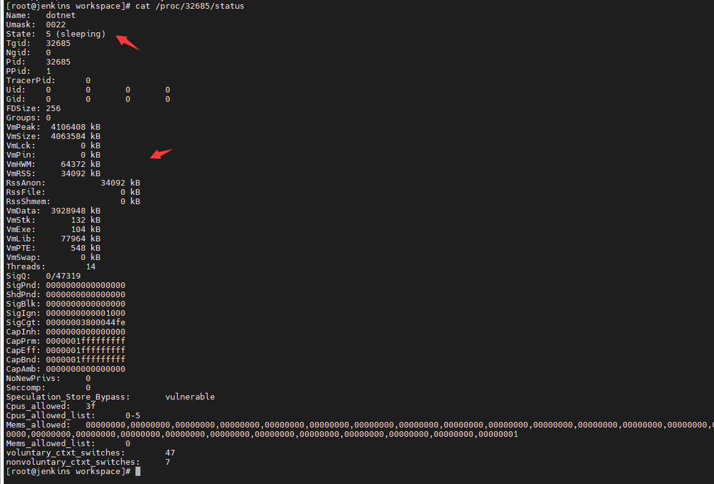

jenkins 又又又502了，上jenkins服务器看了下内存占用快满了

猜测是与dotnet有关（我们主要部署的是dotnet程序）
```shell
ps aux|grep dotnet|grep -v grep
```

发现大量dotnet相关进程

捞一个看看

果然，sleep状态的进程吃了很多系统资源，应该是jenkins还没来得及释放

我们手动给他干掉

```shell
ps aux|grep dotnet|grep -v grep|awk '{print $2}'|xagrs kill -9
```


**我的jenkins是单独部署的。。至少和dotnet服务不在一块，不然kill的时候要多加小心，别吧服务kill了哦**


jenkins并发构建带来的问题。。


并发构建很爽，可以充分利用服务器资源，伸缩同一时间构建任务的执行线程，但运行了段遇到个偶发问题：

有人反馈，自己的服务有时候构建就不行了，全是失败，之前还好好的


经过排查，发现是并发导致的，这里有A开发和B开发以及一个S服务，A push代码到S，jenkins开始构建S，但是构建需要时间

在这个过程中，B同事也 push了一份commit到S，由于还有空余的工作线程，于是，此时两个线程同时执行构建S。。。

自然，出现了咱服务端开发er最最熟悉的线程安全问题

初始解决方案很简单，手动关掉卡死的job，然后再点一下构建，就解决了


但也应不住隔三岔五的去点呀。。于是。。


这样的话就变成串行构建了


勾选下面的Abort previous builds话，后来的构建将直接中止正在执行的构建

这个选项看上去极具诱惑（节省服务器资源嘛），实则也有点问题，不多赘述，自己尝试